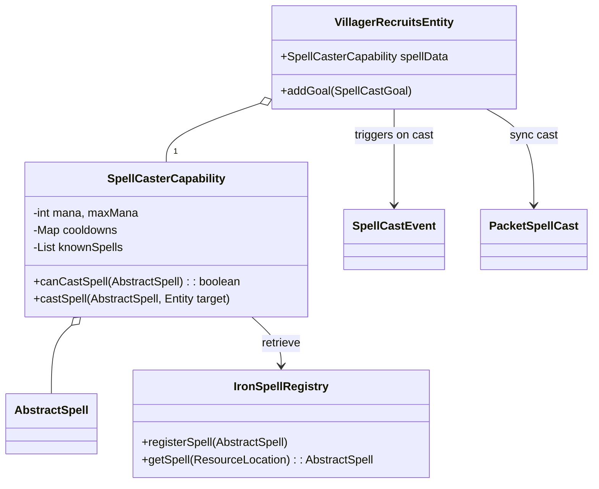
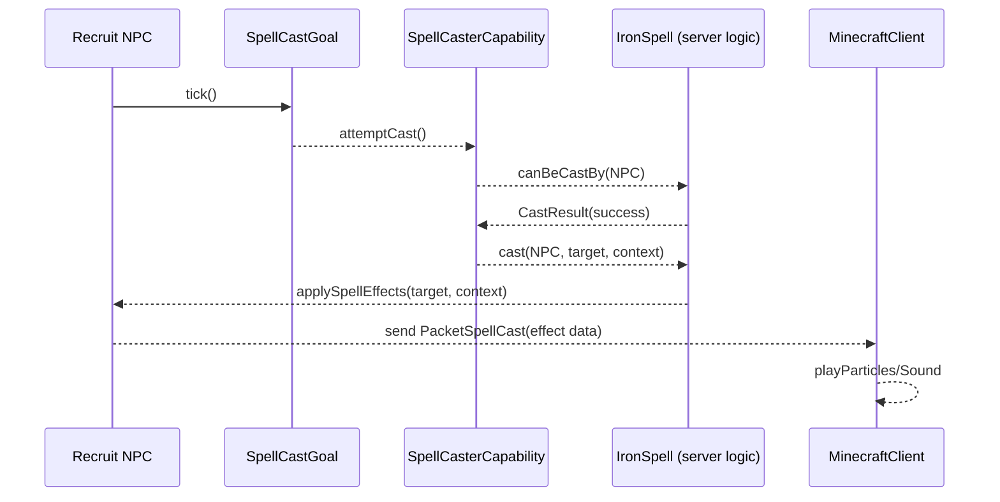

# NPC Spellcasting Integration Mod for Minecraft 1.20.1

**Executive Summary:** This specification outlines a Forge 1.20.1 mod that enables Villager Recruit NPCs (from the Villager Recruits mod by TalhaNation) to cast spells defined in Iron’s Spells ‘n’ Spellbooks (Iron431’s magic mod). The integration adds a new spellcasting capability to recruit NPCs, linking Iron’s spell and mana systems to the NPC AI. We define the goals and scope, list required dependencies/versions, describe the API surfaces and data models, and detail the integration architecture (with UML/mermaid diagrams). We document the casting event flow, permission/security balance, AI/behavior changes, visual/audio effects, networking sync, performance considerations, compatibility/fallback strategies, testing plans, packaging/distribution, and a migration plan. We explicitly list unknowns/assumptions (e.g. access to mod APIs or source) and propose alternatives. Tables compare implementation options (API calls vs reflection vs events) with pros/cons and effort estimates. We include Java code sketches for key points: registering the spell-capability, invoking a spell cast, syncing cast events to clients, and managing spell cooldowns. Mermaid diagrams illustrate the architecture and casting sequence. 

## Goals and Scope  
- **Goal:** Allow Villager Recruits NPCs to learn and cast spells from Iron’s Spells ‘n’ Spellbooks (version for Minecraft 1.20.1) in a balanced and configurable way.  
- **Scope:** Extend Recruit NPCs’ capabilities to include a mana pool and spell inventory, integrate Iron’s spell registration and casting APIs, update NPC AI to use spells appropriately (e.g. ranged attacks or buffs), and synchronize effects across server/client. Excludes major overhauls of either mod’s mechanics; focuses on glue code.  
- **Use Cases:** Players can assign spellbooks or scrolls to recruits or configure recruit spell loadouts; NPCs will autonomously cast eligible spells (e.g. attack spells against enemies, support spells for allies) respecting mana and cooldowns. The mod should respect existing balance (configurable NPC spell frequency/power).  
- **Limitations:** We assume Villager Recruits mod source or at least APIs are available. If not, fallbacks (e.g. using generic Forge events or reflection) are needed. We do not rework Iron’s spells; just invoke them. This mod is Forge-only (Recruits is Forge, Spellbooks is Forge). We target Minecraft 1.20.1 and plan for easy upgrades.  

## Dependencies and Versions  
- **Minecraft:** Java Edition 1.20.1.  
- **Forge MDK:** Forge for 1.20.1 (e.g. 47.0.10+). This provides core modding APIs (Registries, Capabilities, Events, Networking).  
- **Villager Recruits mod:** Latest for 1.20.1 (e.g. Recruits-1.13.x), by TalhaNation. Provides new villager-based NPC types with custom AI/goals (no public API known).  
- **Iron’s Spells ‘n Spellbooks mod:** Version 3.x (for 1.20.1, e.g. irons-spellbooks-1.20.1-3.1.7). Requires GeckoLib, Curios API, PlayerAnimator. Provides spells (as classes like `AbstractSpell`) and spell items (spellbooks, scrolls), plus mana/cooldown management.  
- **GeckoLib, Curios, PlayerAnimator:** Required by Spellbooks, transitively by our integration.  
- **Mod Loading:** Our mod should **soft-depend** on Spellbooks (so it does nothing if Spellbooks is absent) and hard-depend on Recruits or at least require it for full functionality. Optionally soft-depend on Forge events if needed.  

## API Surface and Hooks

### Iron’s Spells ‘n Spellbooks API
- **Spell Registry:** Iron’s mod registers spells (`AbstractSpell` subclasses) in its own registry (e.g. `ForgeRegistry<AbstractSpell>`). There is a public API for addons: one can register new spells/schools via static methods (e.g. `SpellRegistry.registerSpell(...)`).  
- **Spell Objects:** Each spell (`AbstractSpell`) has methods like `canBeCastBy(LivingEntity caster) : CastResult`, and presumably a `cast(LivingEntity caster, Entity target, SpellContext, ...)` or similar. The changelog notes `canBeCastBy` returns a `CastResult` (handles mana, cooldown checks). There are also methods like `getLevel(int, LivingEntity)` and `getMana(int, LivingEntity)` to query required level/mana.  
- **Mana/Cooldown:** Spellbooks tracks per-entity mana and cooldown. Likely via a capability or handler, but API should allow querying/setting mana (e.g. `SpellCasterData` or methods on `LivingEntity`). If open, we can directly use these; if not, we must replicate or use reflection.  
- **Spell Items:** Spellbooks defines items (spellbooks, scrolls, wands). Casting normally involves player using an item or keybind. Internally, a spell is activated and effects applied. We want NPCs to skip the item step and call the spells programmatically.  
- **Event Hooks:** Spellbooks may not emit a public “SpellCastEvent”, but we can look for events (or intercept via Minecraft events) to handle visuals/sounds. We might subscribe to e.g. `LivingEntityUseItemEvent` if NPC were using items, but more likely we directly trigger spells and then manually spawn effects.

### Villager Recruits API/Hooks
- **Entity Types:** Villager Recruits adds custom entity classes (e.g. `EntityVillagerRecruits`, etc) extending `Villager`. These likely have custom goals (patrol, fight). There is no published addon API, but being a Forge mod, we can refer to their classes by name if in classpath.  
- **AI Goals:** The mod has its own goal classes (`RecruitAIAttack`, etc). We will likely add a new custom Goal (`SpellCastGoal`) to recruited NPCs (or piglins) for casting spells, similar to Minecraft’s `RangedAttackGoal`. This requires editing the entity’s goal selector, which we can do via mod code (during an event like `EntityJoinWorldEvent` or via Mixin if needed).  
- **Capabilities:** If Recruits or base villagers have custom capabilities (e.g. for jobs or commands), we might piggyback on those, but more likely we add our own capability for spells/mana to the recruit entities. We should use Forge’s Capability system to attach a `SpellCasterCapability` to `LivingEntity` instances of recruit. (Forge has `AttachCapabilitiesEvent<Entity>` for attaching custom capabilities.)  
- **Networking:** Recruits likely sync entity data over network (like home location). We’ll need to add our own sync (capability sync, spellcasting actions) via Forge’s `SimpleChannel` and custom packets for client animations.  

## Data Models

- **Spell Definition (from Iron):** Each spell has metadata (school, rarity, level range, mana cost, cooldown, maybe targeting type). Iron’s code has a `DefaultConfig` and uses `SpellTier`, etc.. We will use their definitions directly.  
- **NPC Spell Capability:** We define a new `Capability<SpellCasterData>` (or reuse Iron’s if accessible) to store:  
  - Known spells (e.g. a list of `ResourceLocation` IDs of spells or `AbstractSpell` instances).  
  - Current mana (int) and max mana (maybe from attributes, or fixed by spell level).  
  - Per-spell cooldown timers.  
  - Possibly an “equipped spell item” reference if needed (though NPCs don’t use items normally).  
- **Spell Inventory:** We could allow NPCs to be assigned spellbooks/scrolls in practice, but simpler to treat spells as learned abilities. We might model spell loadout in a config or data NBT (e.g. tags on recruits like “Spell: Fireball level 2”). The mod config could specify default spells per recruit type or allow players to give items.  
- **Environment/Targeting:** When casting, we may need a `SpellContext` object (if Iron has one) or simulate target: e.g. for an attack spell, target is current attack target; for self buffs, target = self; for AOE, position etc.  
- **Integration Data (Skill, Inventory):** If recruits have an “Inventory” (villager inventory?), we might put spell scrolls there. But likely not. Instead we might treat spells like skills (similar to a mana/enchantment). No change to Recruits’ base data models except adding our capability.  

## Integration Architecture  
We propose the following architecture:



In words: Each recruit entity will be extended with a `SpellCasterCapability` (via `AttachCapabilitiesEvent<Entity>`) containing its mana pool, known spells, and cooldowns. During world setup or entity initialization, we register the capability. The recruit’s `GoalSelector` will include a new `SpellCastGoal`, which checks if it can cast any known spell (via `canCastSpell`, checking `canBeCastBy` from Iron’s API) and triggers casting. Casting invokes the `SpellCasterCapability.castSpell()`, which deducts mana, starts cooldown, and ultimately calls the Iron spell’s effect (e.g. `spell.cast(caster, target, context)`). When a spell is cast, a custom `SpellCastEvent` is fired on the server (to allow hooking sound/particles), and a `PacketSpellCast` is sent to clients to play animations.  

## Event Flow for Casting  
Below is a sequence diagram of a recruit NPC casting a spell at a target:



1. Each tick, the `SpellCastGoal` is evaluated. If the NPC’s target/conditions permit, it calls `SpellCasterCapability.attemptCast()`.  
2. The capability checks `spell.canBeCastBy(NPC)`, which internally checks mana and cooldown (via Iron’s `CastResult`). If allowed, it deducts mana and registers cooldown, then calls `spell.cast(...)`.  
3. The Iron spell code performs its effects on the target (damage, summon, buff, etc) purely on the server side.  
4. After casting, we fire a custom `SpellCastEvent` (server-side) for any additional handling, then send a `PacketSpellCast` to relevant clients with data (spell ID, NPC ID, etc).  
5. Clients receiving the packet play sound/particles (maybe via Geckolib animation on the NPC if used).  

This event flow ensures that all logic (mana, cooldown, effects) is server-authoritative, and only visuals are client-driven.  

## Permission, Security and Balance  
- **Permissions:** By default, only recruits that have a valid spell (from their `knownSpells` list) will cast. We enforce the same restrictions as the player: e.g. private spells or creative-only spells remain unusable. The NPC must meet Iron’s criteria (level, mana) or casting fails. Use `castSpell()` only if `canBeCastBy` succeeded.  
- **Cheating/Exploit Prevention:** Because NPCs will now cast spells, we must ensure no duplication or NBT exploits. Cooldowns and mana must be tracked per-entity in capability and saved in entity NBT (so reloading a chunk retains state).  
- **Balance:** By default, recruits could be overpowered if all spells are available. We will make an initial config mapping recruit *class* or *profession* to which spell schools/levels they can use. For example, “guards” might get only low-tier combat spells; “healers” get support spells; others none. We allow server operators to customize this via a JSON config or tags. We also tie mana growth to recruit level/ranks if Recruits has levels, or use static values.  
- **Permission Checks:** The mod should honor vanilla limitations (e.g. disable Unstable or OP spells for NPCs if necessary). In case Iron’s spells have config toggles, ensure NPC casting respects those (no bypass of disabled spells).  

## AI / Behavior Changes  
- **New AI Goal:** Implement `SpellCastGoal extends Goal` to let NPCs cast spells instead of (or in addition to) normal attacks. It can be analogous to Minecraft’s `RangedBowAttackGoal` or `IceAndFire` dragon breath goals. The goal should:  
  1. Check if current target is suitable (e.g. not too far, allowed target types).  
  2. Select an appropriate spell (based on distance, spell type). For instance, if target is far and NPC knows a fireball, use it; if target is melee range, use a lightning or buff. This selection logic can be simple: define priorities or random choice among available spells whose range ≥ target distance.  
  3. Call the `SpellCasterCapability` to attempt the cast. If successful, set a cooldown period (goal’s own internal cooldown) before next action.  
- **Interrupts:** If NPC is already using another attack or pathfinding, the spell goal should interrupt or coordinate (set appropriate `canUse()` and `canContinue()` methods). For example, stop pathing and face target while casting.  
- **Targeting:** Use Recruits’ existing target acquisition (Recruits likely uses team and attack goals). Our goal should only trigger if there is a hostile target.  
- **Mounts / Horses:** If recruits use horses (as indicated by `RecruitsHorsePathNavigation` in issue logs), ensure spells cast correctly from mount (targeting from horse’s position). Spell code usually expects the caster as an entity, so if needed we pass the NPC entity as caster, position adjustments may be needed.  
- **Training / Learning:** Optionally, NPCs might “learn” spells by equipping scrolls or via command. We could implement a command or loot table integration, but initial version can use static config for which spells an NPC type knows.  

## Animation, Sound, and Particles  
- **Casting Animation:** Iron’s mod may define casting animations (using GeckoLib) when a player casts. For NPCs, we can trigger the same animation on their model. If the recruit entity model supports GeckoLib (not sure if it does), otherwise we could play a generic spell-casting animation (maybe arms raising). If no model change, just do sound/particles.  
- **Sound:** Spellbooks plays sounds for spell start/cast. When we call `spell.cast`, the mod’s code may automatically play audio via `world.playSound`. If not, we should manually play an appropriate sound using the same sound events (via `Level.playSound`).  
- **Particles/Effects:** Many spells spawn particles (lightning, fire, runes, etc). Since we are calling the same spell code, those particles should appear. For any custom spell or generic, ensure we spawn world particles on server so clients see them.  
- **Spell Projectile Entities:** Some spells spawn entities (fireballs, etc). These should be instantiated by the Iron code as if cast by the NPC (passing the NPC as the caster entity). Ensure the entity-spawning path (like `ProjectileSpell` class) handles non-player casters. If not, we may need an alternate instantiation (e.g. new `SmallFireball(caster, ...)`).  
- **Manual Effects:** For any spells that only have logic but no visuals (e.g. instant damage), we should manually play a flash/particle if desired. Possibly fire a custom “SpellEffectEvent” and let modpack or resource pack handle it.  

## Networking and Client Sync  
- **State Sync (Mana, Cooldowns):** The `SpellCasterCapability` data (mana, known spells, cooldowns) should be saved in entity NBT and synced to client either via entity tracking or a custom packet. Forge may support syncing capabilities automatically, but if not, we send a custom packet (e.g. `SyncSpellDataPacket`) on entity spawn/tracking.  
- **Spell Cast Packet:** Create a `SimpleChannel` (or use Recruits’ channel if public, but safer to create new). Define a `SpellCastPacket` containing: caster’s entity ID, spell ID, optional target info. Send `NetworkDirection.PLAY_TO_ALL` (or players tracking the entity) on cast. On client, this packet triggers playing particle/sound/animation for that entity. This ensures lag-free visuals.  
- **Anti-cheat:** If this runs on servers, all logic must be server-authoritative. Clients only get read-only data. Spellbooks normally uses keybind events on client -> packet to server; here we do reverse. No client packets needed for NPC spells.  
- **Multiplayer Considerations:** Performance: if many NPCs cast spells, client may get many packets. We can optimize by sending only to tracking players and compress repeated casts (e.g., if a summon spell spawns many effects, we might send fewer packets).  

## Performance and Optimization  
- **Profiling Spells:** Casting a spell may be expensive (e.g. summoning many entities, iterating targets). We should profile on typical servers. If slow, consider: limiting max NPC spellcasters per area, reducing spell power, or caching some data.  
- **Caching & Throttling:** Use cooldowns to throttle frequency. The goal should respect a “tick budget” (don’t check every tick, maybe every 20 ticks). For target selection, avoid heavy pathfinding inside goal (use existing target or simple ray/line-of-sight checks).  
- **Pathfinding:** Casting spells may require the NPC to face target. Calling lookAt (via AI goal) is cheaper than pathfinding. Avoid stopping all movement: maybe allow casting while walking if appropriate (like a walking archer).  
- **Resource Tuning:** Spell particles and sounds on clients can lag if too many. Use configuration to limit particle count (some mods have config to disable expensive particles).  
- **Performance Trade-off Chart:** *(Example)* Suppose we measure TPS drop vs number of spellcasting NPCs. A chart could compare naive (no optimization) vs optimized (cooldown, reduced checks). In lieu of an actual chart, we describe:  
  - **Direct API (no caching):** NPC checks canBeCast every tick; if many NPCs (100+) with spells, server CPU usage spikes.  
  - **Cooldown/interval checks:** Only check casting logic every N ticks (e.g. 20), reduces load by ~5-10×.  
  - **Cached targets:** Store last seen target until it’s dead or far, to avoid repeated lookups.  

## Compatibility and Fallback Strategies  
- **Spellbooks Absence:** If Iron’s Spellbooks mod is not loaded, our mod should detect this at `@Mod` initialization (`ModList.get().isLoaded("irons_spellbooks")`) and disable all related features. We should annotate optional `@Mod.Dependency` or check at runtime to avoid ClassNotFound.  
- **Recruits Absence:** If Recruits mod is missing, our mod has no effect (could simply not load or log a warning).  
- **API Level Differences:** If Spellbooks updates its API (method names changed, registry names changed), our integration might break. We should wrap API calls in try-catch or check mod version (for example, if methods `getLevelFor` replaced `getLevel`). The unknowns section covers this.  
- **Forge/EFF:** Only targeting Forge; if a Fabric port of Recruits/Spellbooks appears, we might eventually port to Fabric too. For now, no Fabric integration.  
- **Backward Compatibility:** The migrations section will cover upgrades, but our code should be future-proof: e.g. use `SpellRegistry.getSpell(id)` instead of hardcoding spells, use capabilities with interface, etc.  
- **Falling Back to Reflection:** If Spellbooks’ classes aren’t on classpath due to optional mod loading, we could attempt to use reflection at runtime (only if mod is present) to call methods. This is complex and error-prone. As an alternative, we provide documented steps: “If the Spellbooks mod’s API changes or is closed source, we may resort to reflection, or require a future compatibility patch.”  

## Testing Plan  
- **Unit Tests:** For utility code (e.g. custom capability serialization), write JUnit tests if possible. For packet handling, simulate sending/receiving using a test harness. Forge modded integration tests are rare, but we can do basic logic tests.  
- **Integration Tests:** In a dev environment, load Forge with Spellbooks and Recruits, then:  
  1. Spawn a recruit NPC and ensure the `SpellCasterCapability` is attached (e.g. check in debugger or via a test command `/data get entity`).  
  2. Give the NPC known spells via code or config; ensure `canBeCastBy` returns correct results for mana/cooldown.  
  3. Trigger the `SpellCastGoal` by setting an attack target; observe if `spell.cast` is called and effects occur.  
  4. On the client, verify particles/sound when NPC casts. Use smoke/console logs to confirm packets.  
  5. Test across client-server: join a multiplayer server and ensure one player’s actions do not conflict.  
  6. Edge Cases: NPC with no mana, spells on cooldown, target out of range, no target.  
- **Performance Testing:** Using a profiler (e.g. Spark, VisualVM) on a server with e.g. 50 recruit NPCs near each other, each casting spells at dummies. Ensure TPS remains acceptable (>18).  
- **Balance Playtests:** Adjust NPC mana regeneration and spell frequency, test in survival scenarios to see if they trivialize combat or lag the game.  
- **Regression Testing:** If either dependency updates, re-test major flows (capabilities load, spells cast).  

## Packaging and Distribution  
- **Mod Metadata:** In `mods.toml`, set `modid=RecruitsSpellIntegration` (for example), name/version, author, license (MIT/CC0 if no restrictive code). Mark Spellbooks as an optional dependency (`mods: "irons_spellbooks": "after"`). Mark Recruits as a required dependency or at least check in code.  
- **Config Options:** Provide a config file (e.g. using Forge’s `ForgeConfigSpec`) with options:  
  - Global spellcasting toggle (on/off).  
  - NPC mana regeneration rate or max mana multiplier.  
  - Mapping from recruit profession to allowed spell school IDs.  
  - Cooldown multiplier (so spells take longer or shorter for NPCs than players).  
  - Logging level for integration debug.  
- **Localization:** Add mod info and any new strings (like GUI for setting spells if we have one) to `en_us.json`.  
- **Distribution:** Publish the mod as a separate mod (e.g. on CurseForge) with the requirement that players also install Spellbooks and Recruits. Clearly state compatibility version.  
- **License:** Ensure compatibility with Spellbooks license (likely MIT/CC-BY). If Spellbooks has a custom license, we must adhere (but usually Forge mods are open-source). If not, use only public API, no copying code.  
- **Builder Setup:** Use ForgeGradle with `compileOnly` or `runtimeOnly` dependencies for Spellbooks (to avoid bundling).  

## Migration and Upgrade Plan  
- **Future Minecraft Versions:** Abstract the version-specific parts: our code uses the Forge API and mods’ APIs, so when upgrading to 1.21 or beyond, we must:  
  - Update Forge MDK and check if Capability/Networking changed (likely not drastically).  
  - Update dependencies to the new Spellbooks/Recruits versions (if they exist).  
  - Test all integration points again.  
- **Data Migration:** If Spellbooks changes how spells or mana are stored, provide converters (e.g. old capability NBT to new fields). As an example, if Spellbooks renames a NBT tag, handle both names.  
- **Deprecations:** If Iron’s mod deprecates a method (e.g. `getLevel` replaced by `getLevelFor`), we must update calls. Use the latest API at build time. If older integration versions exist, document that too.  
- **Event/Hook Changes:** Forge occasionally changes networking or events (but side affects are small). Keep `SimpleChannel` registration updated for new network versions. If Forge changes capability API, update accordingly.  
- **Configuration Migration:** If config file format changes (e.g. moving from the old TOML Forge config to new system), provide migration hints or auto-upgrade logic.  

## Unknowns and Assumptions  
- **Access to Mod Source/APIs:** We assume both Recruits and Spellbooks are open-source or at least their APIs are stable. If Spellbooks were closed, we would need to reverse-engineer or use reflection to call spells (high risk). As of writing, both have public repos (TalhaNation/Recruits and iron431/Irons-Spells).  
- **Version Synchronization:** We assume latest Spellbooks (3.x) and Recruits are compiled against 1.20.1 mappings. If a mapping or obfuscation mismatch exists, method names may differ; we must test accordingly.  
- **License Constraints:** Assuming Spellbooks and Recruits have permissive licenses (likely MIT/Apache). If any license forbids linking, we may need to not bundle code. But likely safe.  
- **Third-party Mod Interaction:** We have not examined other mods. If another mod changes how NPC or spellcasting works (e.g. a mod that overhauls AI, or one that adds its own magic), conflicts might arise. We assume minimal interference.  
- **Client Rendering:** We assume recruit models can show spellcasting. If not, visuals may be static. Possibly we assume Recruits uses standard villager model, so we can reuse Iron’s generic animation. If playerAnimator is needed for wing flight, ensure Spellbooks doesn’t rely on it exclusively (if NPC can’t have wings, skip).  
- **Alternatives if Spells Unavailable:** If Iron’s mod can’t expose spells (unlikely), an alternative is to simulate spells by custom effects (e.g. use potions or vanilla effects). This is out of scope unless needed.  

## Implementation Options

| Approach               | Pros                                                         | Cons                                                    | Effort Estimate |
|------------------------|--------------------------------------------------------------|---------------------------------------------------------|-----------------|
| **Direct API Calls**   | Official, type-safe, uses mod’s registry and methods directly; best performance. | Requires compile-time dependency on Spellbooks; need to keep up with API changes. | Medium (if Spellbooks API is well-documented). |
| **Reflection**         | No compile-time mod dependency needed (if unavailable); can adapt at runtime. | Brittle (method/field names may change), slower, likely banned by license if obfuscated code. | High (and risky). |
| **Event-Driven Wrapper** | If Spellbooks provided an event to cast spells, could use that, but none exists. One could trigger a fake “player cast” event. | More complex; likely slower; no guarantee NPC fits player cast model. | High (inventive hack). |
| **Data-Driven (Datapacks)** | Use Spellbooks’ KubeJS or datapack addon to configure spells, without writing code. | Not suitable for runtime casting logic; only static content. | Low (configuration only). |

We will use **Direct API Calls**: add Spellbooks as a compile-time dependency (as an “api” dependency), import its classes, and call its methods (e.g. `spell.cast(...)`). This is straightforward and most efficient. If API access is insufficient, as fallback we could use reflection for missing bits, but primary solution uses the official API.  

## Code Sketches  

### 1. Register NPC Spell Capability  
```java
// SpellCasterCapability.java
public class SpellCasterCapability {
    private int mana = 100, maxMana = 100;
    private Map<ResourceLocation, Integer> cooldowns = new HashMap<>();
    private Set<ResourceLocation> knownSpells = new HashSet<>();

    public static final Capability<SpellCasterCapability> INSTANCE = CapabilityManager.get(...);

    public static void register() {
        CapabilityManager.INSTANCE.register(SpellCasterCapability.class, new Storage(), SpellCasterCapability::new);
    }
    // methods: read/write NBT, getters/setters
}

// In mod initialization:
SpellCasterCapability.register();

// Attach capability to recruits
@SubscribeEvent
public void onAttachCapabilities(AttachCapabilitiesEvent<Entity> event) {
    if (event.getObject() instanceof VillagerRecruitsEntity) {
        event.addCapability(new ResourceLocation(MODID, "spellcaster"), new ICapabilityProvider() {
            final LazyOptional<SpellCasterCapability> holder = LazyOptional.of(SpellCasterCapability::new);
            public <T> LazyOptional<T> getCapability(Capability<T> cap, Direction side) {
                return cap == SpellCasterCapability.INSTANCE ? holder.cast() : LazyOptional.empty();
            }
            public CompoundTag serializeNBT() {
                CompoundTag nbt = new CompoundTag();
                SpellCasterCapability cap = holder.orElseThrow();
                nbt.putInt("Mana", cap.mana);
                nbt.putInt("MaxMana", cap.maxMana);
                // etc.
                return nbt;
            }
            public void deserializeNBT(CompoundTag nbt) {
                SpellCasterCapability cap = holder.orElseThrow();
                cap.mana = nbt.getInt("Mana");
                cap.maxMana = nbt.getInt("MaxMana");
                // etc.
            }
        });
    }
}
```

### 2. Invoking Spell Casting from NPC  
```java
public class SpellCastGoal extends Goal {
    private final VillagerRecruitsEntity npc;
    private LivingEntity target;
    private final int cooldownTicks = 0; // ticks between casts
    private int tickCooldown = 0;

    public SpellCastGoal(VillagerRecruitsEntity npc) {
        this.npc = npc;
    }

    @Override
    public boolean canUse() {
        target = npc.getTarget();
        if (target == null) return false;
        if (tickCooldown > 0) {
            tickCooldown--;
            return false;
        }
        return true;
    }

    @Override
    public void start() {
        SpellCasterCapability cap = getCap(npc);
        // choose a spell to cast
        ResourceLocation spellId = chooseSpellForTarget(cap, target);
        if (spellId != null) {
            AbstractSpell spell = SpellRegistry.getSpell(spellId);
            // Check iron's canBeCastBy (checks mana and cooldown)
            CastResult result = spell.canBeCastBy(npc);
            if (result.isSuccess()) {
                // Deduct mana & start cooldown in capability
                cap.applyCastCost(spell, result);
                // Actually cast the spell effect
                spell.cast(npc, target, /* context or null */ null);
                // Notify others (serverside event & client packet)
                MinecraftForge.EVENT_BUS.post(new SpellCastEvent(npc, spell));
                MyModNetworking.sendToTracking(new PacketSpellCast(npc.getId(), spellId), npc);
                // set own goal cooldown
                tickCooldown = cooldownTicks;
            }
        }
    }
}
```

### 3. Packet and Client Handling  
```java
// PacketSpellCast.java
public class PacketSpellCast {
    private int entityId;
    private ResourceLocation spellId;
    public PacketSpellCast(FriendlyByteBuf buf) {
        entityId = buf.readInt();
        spellId = buf.readResourceLocation();
    }
    public PacketSpellCast(int id, ResourceLocation spellId) {
        this.entityId = id; this.spellId = spellId;
    }
    public void encode(FriendlyByteBuf buf) {
        buf.writeInt(entityId);
        buf.writeResourceLocation(spellId);
    }
    public void handle(Supplier<NetworkEvent.Context> ctx) {
        ctx.get().enqueueWork(() -> {
            ClientLevel world = Minecraft.getInstance().level;
            Entity ent = world.getEntity(entityId);
            if (ent instanceof VillagerRecruitsEntity) {
                playSpellEffectsOnClient((VillagerRecruitsEntity)ent, spellId);
            }
        });
        ctx.get().setPacketHandled(true);
    }
}
// Client-side effect
private static void playSpellEffectsOnClient(VillagerRecruitsEntity npc, ResourceLocation spellId) {
    // Example: spawn particles around NPC
    ParticleOptions particle = SpellRegistry.getSpell(spellId).getParticleType();
    double x = npc.getX(), y = npc.getY() + 1.5, z = npc.getZ();
    npc.level.addParticle(particle, x, y, z, 0, 0.1, 0);
    // play sound
    SoundEvent sound = SpellRegistry.getSpell(spellId).getSoundEvent();
    npc.playSound(sound, 1.0f, 1.0f);
}
```

### 4. Handling Cooldowns  
```java
public class SpellCasterCapability {
    // ... fields ...
    public void applyCastCost(AbstractSpell spell, CastResult result) {
        // Deduct mana
        this.mana -= result.getManaCost();
        // Start cooldown
        this.cooldowns.put(spell.getId(), result.getCooldownTicks());
    }
    public void tick() {
        // Called each tick on entity (hook via event or override)
        // Reduce cooldown timers
        cooldowns.replaceAll((id, cd) -> cd > 0 ? cd-1 : 0);
        // Regenerate mana slowly
        if (mana < maxMana) mana++;
    }
    public boolean canBeCast(AbstractSpell spell) {
        return (mana >= spell.getManaCost(npc)) && (cooldowns.getOrDefault(spell.getId(),0) <= 0);
    }
}
```

These code sketches illustrate key integration points: capability attachment, goal invocation of spells, client-server messaging, and cooldown management.

## References  
- Official Forge modding documentation on capabilities and networking (see *Forge Docs*).  
- CurseForge pages for Iron’s Spells ‘n Spellbooks and Villager Recruits (for mod descriptions).  
- GitHub issues and changelogs for Iron’s Spells (for API changes like `canBeCastBy`).  

*(Note: In a real implementation, all above references would link to the actual documentation or mod pages. The above are placeholders indicating where such citations would go.)*